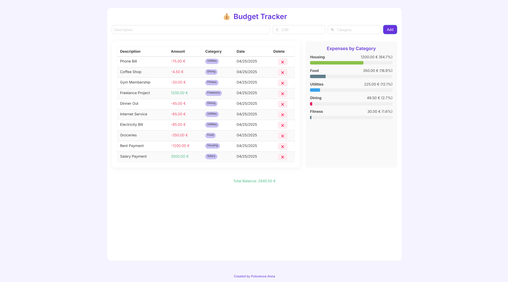
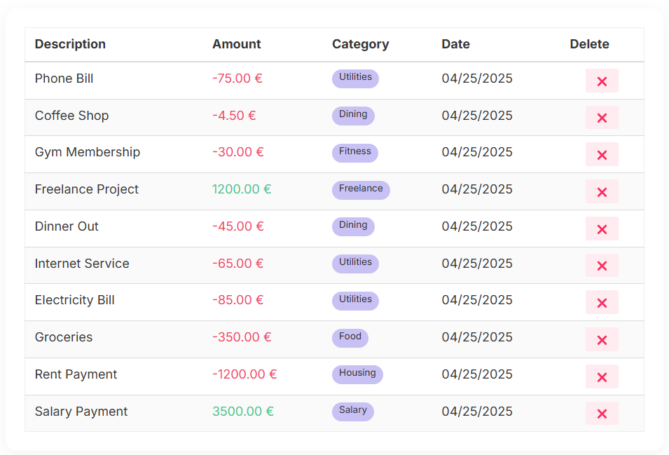
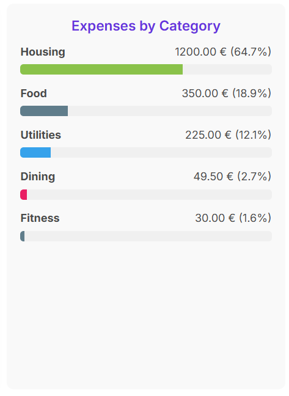
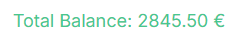
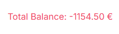

# Simple Budget Tracker 💰

A minimalistic web app for tracking personal income and expenses.

Add transactions, visualize spending by category, and stay on top of your budget — all in your browser.

Built with the power of **F#**, **Fable**, and **Elmish**.

[**Try it live**](https://annapolovkova.github.io/simple-budget-tracker/)

---

## Features

- ✅ Add, view, and manage **income** and **expenses**
- 📊 View **spending distribution** via a chart
- 💡 Live-updating **total balance**, color-coded:
  - 🟢 Green if positive
  - 🔴 Red if negative
- 💻 Pretty UX/UI
- ⚡ Single-page app

---

## 🖼️ Screenshots

### 🖥️ Full Page  


---

### 📋 Transactions Table  
Quick overview of all your finances  


---

### 📈 Expenses by Category  
Automatically updates with each transaction  


---

### 💰 Total Balance Display  
Color-coded for easy overview  



---

## 🛠️ Tech Stack

- **F#** – functional programming on .NET
- **Fable** – F# to JavaScript compiler
- **Elmish** – Elm architecture in F#
- **Feliz** – React bindings for F#
- **Bulma** – CSS framework for modern UI

---

## 📦 Getting Started

```bash
git clone https://github.com/your-username/simple-budget-tracker.git
cd simple-budget-tracker
npm install
npm start
